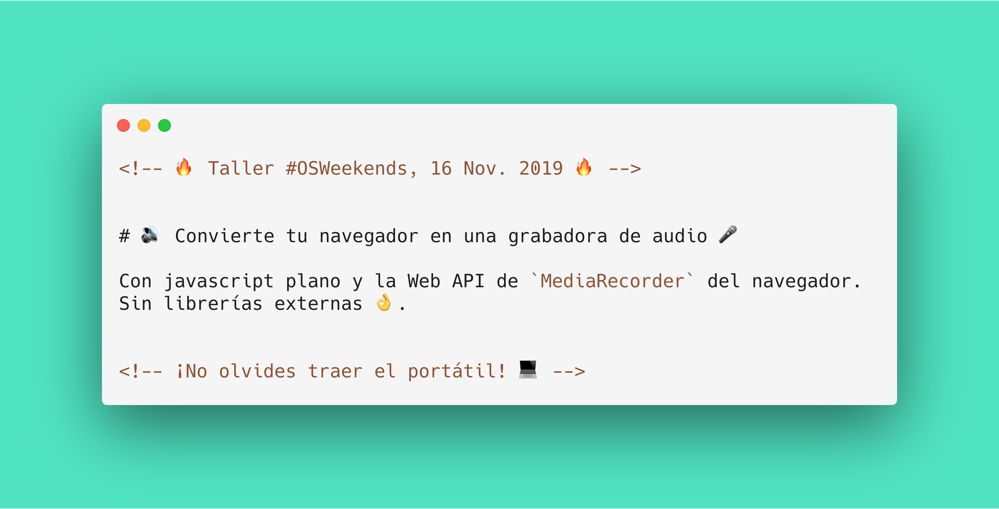

# 🔊 Convierte tu navegador en una grabadora de audio 🎤

[](https://app.netlify.com/sites/browser-audio-recorder-workshop/deploys)
[](https://github.com/baumannzone/browser-audio-recorder-workshop/pulls)
[](https://github.com/baumannzone/browser-audio-recorder-workshop/commits/master)
[](https://img.shields.io/badge/code%20style-standard-brightgreen?style=flat-square)

> ¿Alguna vez te has preguntado cómo puedes acceder al micrófono de tu pc usando javascript desde un navegador? Con la llegada de la API de `MediaRecorder` a los navegadores, hacer esto es muy fácil.   
> En este taller veremos, gracias a **javascript**, cómo acceder al micrófono desde el navegador y crear nuestra grabadora.

---



## Requisitos

💻 Traer portátil y tener instalado:

- [Node.js](https://nodejs.org/es/)
- [Git](https://git-scm.com/)
- Navegador moderno _(Recomendado Google Chrome)_


- Opcional: [VueDevTools](https://github.com/vuejs/vue-devtools#installation)
- 🖖💚 Chuleta: [Vue-Essentials-Cheat-Sheet.pdf](https://www.vuemastery.com/pdf/Vue-Essentials-Cheat-Sheet.pdf)


---

## Instalación Proyecto
```
npm install
```

### Compilar + Live-Reloading para Desarrollo
```
npm run serve
```

### Compila y minimiza para production
```
npm run build
```

### Correr los test unitarios
```
npm run test:unit
```

### Ejecutar el linter
```
npm run lint
```

### Customize configuration
See [Configuration Reference](https://cli.vuejs.org/config/).
